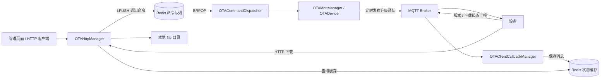

# ota-new

基于 C++17 的 OTA（Over-the-Air，空中升级）服务端项目。项目以 `sherry` 网络库为基础，通过 HTTP 提交升级通知、查询设备状态和下载文件，通过 MQTT 与设备交换消息，并使用 Redis 保存状态和传递异步命令。

当前 OTA 服务入口是 [`tests/test_ota_server.cc`](tests/test_ota_server.cc)，构建产物为 `bin/test_ota_server`。仓库保留了演示固件数据、旧测试代码和待完善的部署配置，接入设备前请先阅读本文的「当前限制」。

## 功能与架构

- **HTTP 管理接口**：升级通知提交、设备版本缓存查询、下载状态缓存查询、文件下载，以及简易管理页面。
- **MQTT 消息通信**：按设备类型建立客户端，订阅设备上报，并定时发送升级通知。
- **Redis 状态与队列**：设备消息按配置写入缓存；HTTP 提交的通知进入 Redis List，由后台线程消费。
- **底层网络组件**：协程、线程调度、基于 epoll 的 IOManager、定时器、Socket、HTTP 解析与连接、日志、YAML 配置、字节数组和压缩流。



HTTP 查询接口直接读取缓存。通知提交成功表示命令已入队，设备是否收到通知、下载或完成升级，需要结合 MQTT 消息和服务日志确认。

## 目录结构

```text
.
├── CMakeLists.txt             # sherry 共享库、测试与示例目标
├── cmake/                    # Ragel 生成规则及构建辅助函数
├── config/ota_system.yaml    # Redis 连接池与 MQTT 设备配置
├── file/                     # 管理页面和下载示例文件
├── include/json/             # 内置 nlohmann/json 头文件
├── sherry/
│   ├── http/                 # HTTP 协议、解析器、服务端与客户端
│   ├── db/                   # Redis、连接池与异步线程封装
│   ├── ota/                  # OTADevice 等设备相关实现
│   ├── ota_*                 # HTTP/MQTT 管理、命令分发与通知
│   └── streams/              # zlib 压缩流
├── tests/                    # 组件测试、联调程序与 OTA 服务入口
├── examples/echo_server.cc   # TCP Echo 示例
├── scripts/                  # HTTP 请求及 wrk Lua 脚本
├── recording/                # 开发笔记，部分内容与当前实现有差异
└── share/doc/Eclipse Paho C/ # Paho C 文档、样例及许可文件
```

## 构建

### 环境与依赖

使用 **Linux** 开发环境。底层代码依赖 `epoll`、`ucontext` 和 Linux `sendfile`，不能直接按原样在 macOS 或 Windows 原生环境编译。

| 依赖 | 用途 |
| --- | --- |
| 支持 C++17 的编译器、GNU Make、CMake 3.x | 编译与构建 |
| Ragel | 从 `.rl` 文件生成 HTTP/URI 解析器 |
| yaml-cpp、Boost 头文件 | 配置解析与类型转换 |
| OpenSSL、zlib | SSL、哈希与压缩 |
| Eclipse Paho MQTT C++ 与 C | `paho-mqttpp3`、`paho-mqtt3as` |
| hiredis、hiredis-vip、libevent | Redis 普通/集群连接与异步 IO |
| Redis 服务、MQTT Broker | OTA 服务运行时依赖 |

以 Ubuntu 22.04 的包名为例，安装基础依赖及本地联调工具：

```bash
sudo apt-get update
sudo apt-get install -y \
  build-essential cmake git pkg-config ragel \
  libyaml-cpp-dev libboost-all-dev libssl-dev zlib1g-dev \
  libevent-dev libhiredis-dev libpaho-mqtt-dev libpaho-mqttpp-dev \
  redis-server mosquitto mosquitto-clients curl
```

还需单独安装 [hiredis-vip](https://github.com/vipshop/hiredis-vip)，例如在项目目录之外执行：

```bash
git clone https://github.com/vipshop/hiredis-vip.git
cd hiredis-vip
make -j2
sudo make install
sudo ldconfig
```

安装后应能找到 `hiredis-vip/hircluster.h` 和 `libhiredis_vip.so`。虽然 CMake 对缺失 hiredis-vip 只打印警告，但源码无条件包含其头文件并链接其库，因此当前构建需要它。该上游仓库已归档，本项目也未锁定第三方依赖版本，升级依赖后需要重新验证兼容性。

### 编译 OTA 入口

```bash
git clone https://github.com/BabyDrangoner/ota-new.git
cd ota-new

cmake -S . -B build -DCMAKE_BUILD_TYPE=Debug
cmake --build build --target test_ota_server -j2
```

产物输出在项目根目录下：

- `lib/libsherry.so`：共享库。
- `bin/test_ota_server`：OTA 服务入口。
- 其他测试与示例目标也输出到 `bin/`。

构建前请核对 [`CMakeLists.txt`](CMakeLists.txt) 中的环境假设：

- 保留了 `/build/yaml-cpp-0.8.0/include`、`/apps/sherry/lib` 以及 x86_64 Redis 库搜索路径；使用自定义安装目录时需按实际环境调整，避免混用不同版本的头文件和库。
- 项目声明的 CMake 最低版本仍为 `2.8`，使用 CMake 4.x 时需要先更新兼容性声明。
- 编译参数包含 `-O0 -ggdb -Werror`；编译器或依赖版本变化可能把警告变成构建失败。
- CMake 显式列举源码与可执行目标；新增文件后需要同步更新构建列表。

## 配置与启动

### 1. 配置 Redis 和 MQTT

编辑 [`config/ota_system.yaml`](config/ota_system.yaml)，并启动对应的 Redis 服务与 MQTT Broker。

| 配置项 | 当前用途 / 默认值 |
| --- | --- |
| `redis.config.http_pool` | HTTP 请求访问 Redis 的连接池，默认 10 个连接 |
| `redis.config.ota_pool` | OTA 状态与 MQTT 回调使用的连接池，默认 10 个连接 |
| `redis.config.ota_mq_pool` | 阻塞消费队列的独立连接池，默认 1 个连接、`timeout: 0` |
| Redis `host` | 默认 `127.0.0.1:6379` |
| Redis `passwd` | 三个连接池都需与实际 Redis 密码一致；本地无密码服务设为 `""` |
| `mqtt.devices` | 默认配置设备类型 `1`、`2`，Broker 为 `tcp://127.0.0.1:1883` |

每个 MQTT 设备配置中的 `sub_topics`、`sub_qos`、`redis_keys` 和 `expire_seconds` 按索引一一对应，**必须保持相同长度和顺序**。`expire_seconds` 为 `0` 时不过期，大于 `0` 时按秒设置缓存有效期。

新增设备类型时，在 `mqtt.devices` 中新增条目；新增模块时，为其配置上报 topic 和对应的 Redis key。HTTP 查询按 `device_type` 与 `name` 拼接 key，必须与配置保持一致。当前 MQTT 客户端 ID 使用设备类型的字符串，在同一个 Broker 上启动多个服务实例时需避免 ID 冲突。

### 2. 调整管理页面地址

[`file/ota.html`](file/ota.html) 中的 `const api` 当前写死了远程地址。通过本服务的 `/ota/` 页面访问时，可将其改为：

```javascript
const api = window.location.origin;
```

### 3. 从项目根目录运行

```bash
LD_LIBRARY_PATH="$PWD/lib${LD_LIBRARY_PATH:+:$LD_LIBRARY_PATH}" ./bin/test_ota_server
```

服务默认监听 `0.0.0.0:8020`，管理页面地址为 [http://127.0.0.1:8020/ota/](http://127.0.0.1:8020/ota/)。监听地址写在 `tests/test_ota_server.cc` 中，尚未接入 YAML 或命令行参数。

程序从当前工作目录加载 `./config/ota_system.yaml`、`./file/ota.html` 和 `./file/` 下的下载文件，因此需要在项目根目录启动。检查日志中的配置加载、Redis 连接、MQTT 连接和 topic 订阅结果；配置加载失败后程序仍会继续执行，不能仅凭进程存在判断启动成功。

## HTTP 接口与联调

以下方法是客户端调用约定；当前路由处理器没有完整限制 HTTP 方法。接口实现见 [`sherry/ota_http_manager.cc`](sherry/ota_http_manager.cc)。

| 方法 | 路径 | 请求 / 行为 |
| --- | --- | --- |
| `GET` | `/ota/` | 返回管理页面 |
| `POST` | `/ota/notify` | JSON：`command`、`device_type`、`name`、`version`；提交通知命令 |
| `POST` | `/ota/query` | JSON：`device_type`、`name`；读取版本上报缓存 |
| `POST` | `/ota/query_download` | JSON：`device_type`、`name`；读取下载状态缓存 |
| `GET` | `/ota/file_download/{device_type}/{name}/{version}` | 下载本地文件 |

### 模拟设备上报并查询

服务完成 MQTT 订阅后，可以使用默认设备类型 `1`、模块 `gps` 做本地联调。以下 JSON 是演示 payload；服务当前按原文缓存上报内容，并未强制规定其字段结构。

```bash
mosquitto_pub -h 127.0.0.1 -p 1883 -q 1 \
  -t '/ota/device/query/1/gps' \
  -m '{"device_type":1,"name":"gps","version":"1.0.01"}'

curl -i -X POST http://127.0.0.1:8020/ota/query \
  -H 'Content-Type: application/json' \
  -d '{"device_type":1,"name":"gps"}'
```

等待 MQTT 回调写入 Redis 后，查询应返回上报的原始内容。下载状态可类似验证：

```bash
mosquitto_pub -h 127.0.0.1 -p 1883 -q 1 \
  -t '/ota/device/query_download/1/gps' \
  -m '{"device_type":1,"name":"gps","progress":50}'

curl -i -X POST http://127.0.0.1:8020/ota/query_download \
  -H 'Content-Type: application/json' \
  -d '{"device_type":1,"name":"gps"}'
```

默认下载状态缓存 20 秒后过期，需要设备持续上报。缓存不存在时，接口仍返回 HTTP 200，正文为 `device not exists.` 或 `device is not downloading.`。

### 提交升级通知

在一个终端订阅通知 topic：

```bash
mosquitto_sub -h 127.0.0.1 -p 1883 -q 1 -v -t '/ota/1/gps/notify'
```

在另一个终端提交：

```bash
curl -i -X POST http://127.0.0.1:8020/ota/notify \
  -H 'Content-Type: application/json' \
  -d '{"command":"notify","device_type":1,"name":"gps","version":"1.0.01"}'
```

`command: "notify"` 必须随请求发送：HTTP 层将原始请求正文入队，后台分发器依赖该字段。入队成功时正文为 `task submits successfully.`；同一设备类型、模块已有相同版本记录时会返回已发布提示。

在消费者正常运行且 MQTT 已连接的情况下，通知器每 10 秒向 `/ota/{device_type}/{name}/notify` 发布一次消息，使用 QoS 1、`retain=true`。消息字段包括 `name`、`version`、`file_name`、`file_size`、`url_path`、`md5_value`、`launch_mode`、`upgrade_mode`、`time`。其中固件信息仍含硬编码示例值，尚未自动关联本地下载文件。

HTTP 响应目前混用 JSON 和纯文本，客户端应先读取响应正文，不能假设所有响应都能用 `res.json()` 解析。

### 下载示例文件

文件命名规则为 `file/ota_{device_type}_{version}_{name}.jpg`。仓库内置 `file/ota_1_1.0.01_gps.jpg`，对应：

```bash
curl --fail http://127.0.0.1:8020/ota/file_download/1/gps/1.0.01 \
  --output downloaded-gps.jpg
```

当前下载响应固定使用 `image/jpeg`，`X-Content-MD5` 也是占位值。新增真实固件格式时，需要同步调整文件命名、内容类型、校验值和通知中的下载 URL；仓库尚无固件上传接口。

## MQTT 与 Redis 对照

下表中的 `T` 表示设备类型，`N` 表示模块名。上报 topic 和缓存 key 由 YAML 决定，表内为现有配置遵循的格式。

| 用途 | MQTT topic / Redis key | 说明 |
| --- | --- | --- |
| 服务发送通知 | `/ota/T/N/notify` | 周期发布，保留消息 |
| 设备上报版本 | `/ota/device/query/T/N` → `ota:device:query:T:N` | 默认不过期 |
| 设备上报下载状态 | `/ota/device/query_download/T/N` → `ota:device:query_download:T:N` | 默认有效期 20 秒 |
| 已通知版本 | `ota:device:notify:T:N` | 记录版本字符串，用于重复提交判断 |
| 后台命令队列 | `ota:device:message` | HTTP `LPUSH`，消费者 `BRPOP` |

队列分发器目前仅注册 `notify` 和 `stop_notify`。停止通知命令的 JSON 格式为：

```json
{"command":"stop_notify","device_type":1,"name":"gps","version":"1.0.01"}
```

该命令需由 Redis 客户端写入 `ota:device:message` 队列；当前没有注册 `/ota/stop_notify` HTTP 路由。停止逻辑取消定时器并删除版本记录，尚未清除 Broker 中已保留的通知消息。

## 测试与示例

[`CMakeLists.txt`](CMakeLists.txt) 已注册多个独立可执行目标，未接入 CTest。可先构建并运行不依赖外部网络服务的组件检查：

```bash
cmake --build build --target test_bytearray test_http test_http_parser -j2
export LD_LIBRARY_PATH="$PWD/lib${LD_LIBRARY_PATH:+:$LD_LIBRARY_PATH}"
./bin/test_bytearray
./bin/test_http
./bin/test_http_parser
```

`test_bytearray` 会在 `/tmp/` 写入测试文件；HTTP 两个示例主要输出序列化和解析结果。`test_redis`、`test_mqtt_client` 以及各种服务端示例需要额外的服务、地址或配置。部分历史测试含本机绝对路径，运行前请检查源码。`tests/` 中并非每个 `.cc` 文件都已注册到 CMake。

## 当前限制

| 范围 | 当前实现与使用影响 |
| --- | --- |
| 通知队列启动 | `OTAMqttManager::start()` 创建消费线程后才设置 `m_running=true`，消费者可能提前退出。若出现命令入队但没有通知，检查 `redis message queue thread exit` 日志；需要完善启动同步。 |
| 固件元数据 | `OTANotifier::get_notify_message()` 中的文件名、大小、URL 和 MD5 是示例值，URL 与当前 HTTP 下载路由不一致。 |
| 通知管理 | 每个 `OTADevice` 只保存一个通知器；同一设备类型下多个模块的并行通知、进程重启后的通知恢复仍需完善。 |
| 管理页面 | API 地址写死，且页面按 JSON 解析部分纯文本响应，需要按实际部署和接口响应调整。 |
| Docker 部署 | 当前 Dockerfile 依赖仓库中不存在的 `lib64/`，缺少部分构建/运行依赖，并从 `/tmp/build/bin/test_server` 复制程序。实际 OTA 产物是 `/app/bin/test_ota_server`，运行镜像还需包含配置、页面、文件目录和所需动态库，并设置工作目录。当前不能直接作为可用部署方案。 |

以上说明以当前构建目标和服务入口为准。扩展功能时，优先沿 `test_ota_server` → `OTAHttpManager` / `OTAMqttManager` → `OTADevice` 的调用链阅读；[`recording/ota_command_dispatcher.md`](recording/ota_command_dispatcher.md) 中的历史命令列表需对照现有分发器确认。
